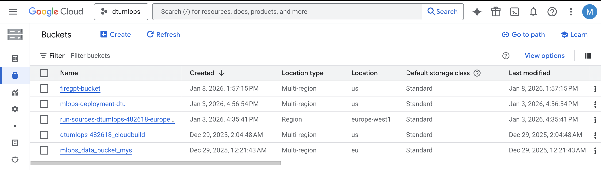
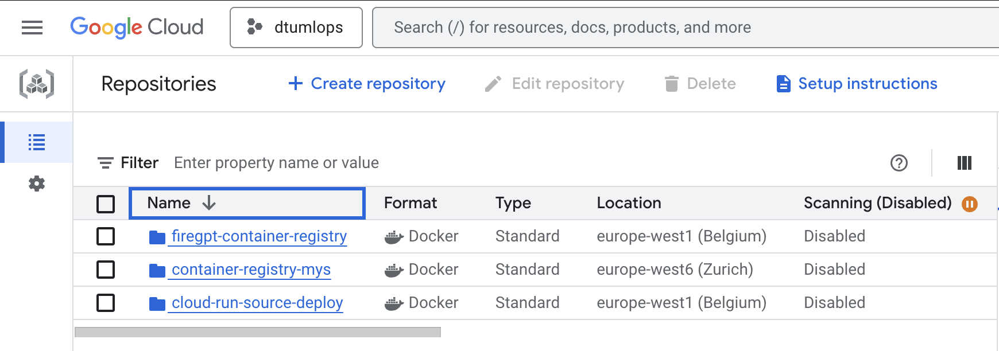
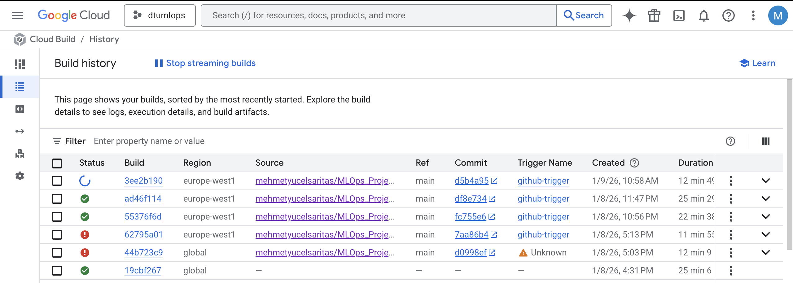
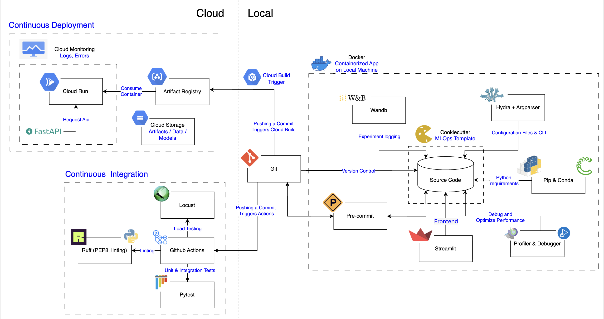

# Exam template for 02476 Machine Learning Operations

This is the report template for the exam. Please only remove the text formatted as with three dashes in front and behind
like:

```--- question 1 fill here ---```

Where you instead should add your answers. Any other changes may have unwanted consequences when your report is
auto-generated at the end of the course. For questions where you are asked to include images, start by adding the image
to the `figures` subfolder (please only use `.png`, `.jpg` or `.jpeg`) and then add the following code in your answer:

``

In addition to this markdown file, we also provide the `report.py` script that provides two utility functions:

Running:

```bash
python report.py html
```

Will generate a `.html` page of your report. After the deadline for answering this template, we will auto-scrape
everything in this `reports` folder and then use this utility to generate a `.html` page that will be your serve
as your final hand-in.

Running

```bash
python report.py check
```

Will check your answers in this template against the constraints listed for each question e.g. is your answer too
short, too long, or have you included an image when asked. For both functions to work you mustn't rename anything.
The script has two dependencies that can be installed with

```bash
pip install typer markdown
```

or

```bash
uv add typer markdown
```

## Overall project checklist

The checklist is *exhaustive* which means that it includes everything that you could do on the project included in the
curriculum in this course. Therefore, we do not expect at all that you have checked all boxes at the end of the project.
The parenthesis at the end indicates what module the bullet point is related to. Please be honest in your answers, we
will check the repositories and the code to verify your answers.

### Week 1

* [x] Create a git repository (M5)
* [x] Make sure that all team members have write access to the GitHub repository (M5)
* [x] Create a dedicated environment for you project to keep track of your packages (M2)
* [x] Create the initial file structure using cookiecutter with an appropriate template (M6)
* [x] Fill out the `data.py` file such that it downloads whatever data you need and preprocesses it (if necessary) (M6)
* [x] Add a model to `model.py` and a training procedure to `train.py` and get that running (M6)
* [x] Remember to fill out the `requirements.txt` and `requirements_dev.txt` file with whatever dependencies that you
    are using (M2+M6)
* [x] Remember to comply with good coding practices (`pep8`) while doing the project (M7)
* [x] Do a bit of code typing and remember to document essential parts of your code (M7)
* [x] Setup version control for your data or part of your data (M8)
* [x] Add command line interfaces and project commands to your code where it makes sense (M9)
* [x] Construct one or multiple docker files for your code (M10)
* [x] Build the docker files locally and make sure they work as intended (M10)
* [x] Write one or multiple configurations files for your experiments (M11)
* [x] Used Hydra to load the configurations and manage your hyperparameters (M11)
* [x] Use profiling to optimize your code (M12)
* [x] Use logging to log important events in your code (M14)
* [ ] Use Weights & Biases to log training progress and other important metrics/artifacts in your code (M14)
* [ ] Consider running a hyperparameter optimization sweep (M14)
* [ ] Use PyTorch-lightning (if applicable) to reduce the amount of boilerplate in your code (M15)

### Week 2

* [x] Write unit tests related to the data part of your code (M16)
* [x] Write unit tests related to model construction and or model training (M16)
* [x] Calculate the code coverage (M16)
* [x] Get some continuous integration running on the GitHub repository (M17)
* [x] Add caching and multi-os/python/pytorch testing to your continuous integration (M17)
* [x] Add a linting step to your continuous integration (M17)
* [x] Add pre-commit hooks to your version control setup (M18)
* [ ] Add a continues workflow that triggers when data changes (M19)
* [ ] Add a continues workflow that triggers when changes to the model registry is made (M19)
* [x] Create a data storage in GCP Bucket for your data and link this with your data version control setup (M21)
* [x] Create a trigger workflow for automatically building your docker images (M21)
* [ ] Get your model training in GCP using either the Engine or Vertex AI (M21)
* [x] Create a FastAPI application that can do inference using your model (M22)
* [ ] Deploy your model in GCP using either Functions or Run as the backend (M23)
* [x] Write API tests for your application and setup continues integration for these (M24)
* [x] Load test your application (M24)
* [ ] Create a more specialized ML-deployment API using either ONNX or BentoML, or both (M25)
* [x] Create a frontend for your API (M26)

### Week 3

* [ ] Check how robust your model is towards data drifting (M27)
* [ ] Deploy to the cloud a drift detection API (M27)
* [ ] Instrument your API with a couple of system metrics (M28)
* [ ] Setup cloud monitoring of your instrumented application (M28)
* [ ] Create one or more alert systems in GCP to alert you if your app is not behaving correctly (M28)
* [ ] If applicable, optimize the performance of your data loading using distributed data loading (M29)
* [ ] If applicable, optimize the performance of your training pipeline by using distributed training (M30)
* [ ] Play around with quantization, compilation and pruning for you trained models to increase inference speed (M31)

### Extra

* [ ] Write some documentation for your application (M32)
* [ ] Publish the documentation to GitHub Pages (M32)
* [x] Revisit your initial project description. Did the project turn out as you wanted?
* [x] Create an architectural diagram over your MLOps pipeline
* [x] Make sure all group members have an understanding about all parts of the project
* [x] Uploaded all your code to GitHub

## Group information

### Question 1
> **Enter the group number you signed up on <learn.inside.dtu.dk>**
>
> Answer:

58

### Question 2
> **Enter the study number for each member in the group**
>
> Example:
>
> *sXXXXXX, sXXXXXX, sXXXXXX*
>
> Answer:

s256629

### Question 3
> **A requirement to the project is that you include a third-party package not covered in the course. What framework**
> **did you choose to work with and did it help you complete the project?**
>
> Recommended answer length: 100-200 words.
>
> Example:
> *We used the third-party framework ... in our project. We used functionality ... and functionality ... from the*
> *package to do ... and ... in our project*.
>
> Answer:

I chose to work with the **FAISS (Facebook AI Similarity Search)** library to implement the vector retrieval component of the project. FAISS played a critical role in building the Retrieval-Augmented Generation (RAG) pipeline by enabling efficient storage and similarity search over high-dimensional text embeddings.

The FAISS library was used in two main stages of the system:

- **Indexing:** In `embedding.py`, I used the `IndexFlatL2` class to construct a flat L2-distance index. The `add` method was then used to store the vector embeddings of the generated text chunks in the index.

- **Retrieval:** In `retrieve.py`, I employed the `read_index` function to load the stored FAISS index from disk and used the `search` method to retrieve the top-*k* most similar text chunks for a given query embedding.

Integrating FAISS enabled efficient and accurate retrieval of relevant contextual information—such as wildfire response protocols—from the dataset. This retrieved context was subsequently passed to the `PromptBuilder`, allowing the language model to generate more accurate and context-aware action plans.


## Coding environment

> In the following section we are interested in learning more about you local development environment. This includes
> how you managed dependencies, the structure of your code and how you managed code quality.

### Question 4

> **Explain how you managed dependencies in your project? Explain the process a new team member would have to go**
> **through to get an exact copy of your environment.**
>
> Recommended answer length: 100-200 words
>
> Example:
> *We used ... for managing our dependencies. The list of dependencies was auto-generated using ... . To get a*
> *complete copy of our development environment, one would have to run the following commands*
>
> Answer:

To ensure robust dependency management and proper environment isolation, this project uses **Miniconda**, **pipreqs**, **Docker**, and **Git**.

A dedicated **Conda environment** was created to avoid conflicts with other projects that may rely on different package versions. Dependency files were generated as follows:
- **`requirements.txt`** was created by explicitly recording the versions of all used Python packages.
- **`environment.yml`** was generated using a Conda environment export.

To guarantee a fully reproducible development environment, the project was containerized using **Docker**.

New team members can clone the GitHub repository and run the following commands to build and start the Docker container:

```docker build -f dockerfiles/firegpt.dockerfile . -t firegpt:latest ; docker run -p 8501:8501 -it firegpt```


### Question 5

> **We expect that you initialized your project using the cookiecutter template. Explain the overall structure of your**
> **code. What did you fill out? Did you deviate from the template in some way?**
>
> Recommended answer length: 100-200 words
>
> Example:
> *From the cookiecutter template we have filled out the ... , ... and ... folder. We have removed the ... folder*
> *because we did not use any ... in our project. We have added an ... folder that contains ... for running our*
> *experiments.*
>
> Answer:

This project was initialized using **Cookiecutter**, which provided a standardized and well-organized starting template.

- **`config/`**
  Contains configuration files for the project, such as framework and environment settings.

- **`data/`**
  Stores all project-related data in my case pdf files that is used in RAG pipeline.

- **`models/`**
  Contains the imported model used in the project.

- **`reports/`**
  Contains exam report and assets related to the report.

- **`outputs/`**
  Stores generated outputs such as performance metrics and analysis results.

- **`src/`**
  Contains the project’s source code, including the model scripts located at `mlops_project/models/*`.

- **`tests/`**
  Includes all test cases and testing scripts, organized into subdirectories.

Compared to the original Cookiecutter template:
- The `LICENSE`, `notebooks`, and `references` directories were removed as they were not relevant to this project.
- A dedicated **`outputs/`** directory was added to improve output tracking.


### Question 6

> **Did you implement any rules for code quality and format? What about typing and documentation? Additionally,**
> **explain with your own words why these concepts matters in larger projects.**
>
> Recommended answer length: 100-200 words.
>
> Example:
> *We used ... for linting and ... for formatting. We also used ... for typing and ... for documentation. These*
> *concepts are important in larger projects because ... . For example, typing ...*
>
> Answer:

To ensure a maintainable and robust codebase, I adhered to strict development guidelines throughout the project.

* **Typing:** I utilized **mypy** for static type checking. All functions include type hints to ensure data consistency (e.g., `query: str` in `retrieve.py`).
* **Documentation:** I adopted **Google-style docstrings** for all classes and methods. This ensures that components like the `Retrieve` class and `Embedding` class are self-explanatory and easy to integrate.
* **Formatting:**  I utilized **Ruff** for code formatting and linting to maintain compliance with PEP8 standards.

In larger projects, these practices are crucial for **scalability** and **collaboration**:
1.  **Maintainability:** Automated linting and formatting prevent "style wars" during code reviews.
2.  **Bug Prevention:** Strict type hinting catches data mismatches early in the development cycle before they cause runtime errors.
3.  **Onboarding:** Comprehensive documentation allows new contributors to understand the system architecture—such as how the `PromptBuilder` constructs inputs—without needing to reverse-engineer the source code.

## Version control

> In the following section we are interested in how version control was used in your project during development to
> corporate and increase the quality of your code.

### Question 7

> **How many tests did you implement and what are they testing in your code?**
>
> Recommended answer length: 50-100 words.
>
> Example:
> *In total we have implemented X tests. Primarily we are testing ... and ... as these the most critical parts of our*
> *application but also ... .*
>
> Answer:

In total, I implemented **around 16 tests** covering unit, integration behavior and load testing. The tests primarily focus on the most critical parts of the application, including text preprocessing and chunking (removal of invisible characters, sentence splitting, and metadata generation), embedding creation and FAISS index construction, and similarity-based retrieval. In addition, data ingestion utilities such as PDF text extraction, broken-word fixing, file saving, and metadata building are tested. External dependencies (NLTK, SentenceTransformer, FAISS, and pdfplumber) are mocked to ensure fast, deterministic, and isolated tests.


### Question 8

> **What is the total code coverage (in percentage) of your code? If your code had a code coverage of 100% (or close**
> **to), would you still trust it to be error free? Explain you reasoning.**
>
> Recommended answer length: 100-200 words.
>
> Example:
> *The total code coverage of code is X%, which includes all our source code. We are far from 100% coverage of our **
> *code and even if we were then...*
>
> Answer:

Total coverage is 92%. No, achieving 100% code coverage does not guarantee that the code is free of errors. Code coverage only indicates the proportion of code executed during tests, but it does not reflect the quality of the tests or verify that the logic is correct. Even if every line is executed, bugs or logical errors may still exist. Furthermore, code coverage does not capture edge cases or unexpected inputs that could cause failures. Therefore, thorough testing and code reviews remain essential for ensuring code quality and reliability. In our project, we have **100% code coverage** for the embedding model (`embedding.py`) and the retrieve (`retrieve.py`). The training script and visualization script are included, but since I did not develop them, they are not covered by our tests.


### Question 9

> **Did you workflow include using branches and pull requests? If yes, explain how. If not, explain how branches and**
> **pull request can help improve version control.**
>
> Recommended answer length: 100-200 words.
>
> Example:
> *We made use of both branches and PRs in our project. In our group, each member had an branch that they worked on in*
> *addition to the main branch. To merge code we ...*
>
> Answer:

I used both feature branches and pull requests throughout the project. However, since I developed this project by myself ı used branches and pull requests less than I would use in my team projects. In theory, every new feature or modification is developed in its own branch. Each branch focused on a specific task: one branch set up a dedicated project environment to manage dependencies, completed the requirements.txt, enforced code formatting, configured version control, defined a configuration file for experiments, and created a GCP Bucket for data storage integrated with our data version control system. Another branch integrated log key metrics and artifacts. A separate branch was dedicated to writing unit tests for the data pipeline, model construction as well as measuring test coverage. Finally, an additional branch implemented a API service for model inference and added a workflow.

### Question 10

> **Did you use DVC for managing data in your project? If yes, then how did it improve your project to have version**
> **control of your data. If no, explain a case where it would be beneficial to have version control of your data.**
>
> Recommended answer length: 100-200 words.
>
> Example:
> *We did make use of DVC in the following way: ... . In the end it helped us in ... for controlling ... part of our*
> *pipeline*
>
> Answer:

I initialized **DVC** in my repository to prepare the project. During development, however, the datasets I used were relatively small and well below GitHub’s file size limits, so I kept the data directly inside the GitHub repository instead of storing it in a separate DVC remote. This approach simplified development and collaboration while avoiding unnecessary infrastructure overhead in the early stages.

Even though I did not fully rely on DVC for managing large datasets, having DVC initialized was still beneficial. It allowed me to design the pipeline with **data versioning and experiment reproducibility** in mind and ensured that the project could easily scale if the data size increased. In a more realistic production or research scenario, DVC would be particularly useful when datasets are large, frequently updated, or shared across multiple experiments. Using DVC in such cases helps track which exact data version was used for each model, reproduce results reliably, and prevent inconsistencies between data, code, and model outputs.

### Question 11

> **Discuss you continuous integration setup. What kind of continuous integration are you running (unittesting,**
> **linting, etc.)? Do you test multiple operating systems, Python  version etc. Do you make use of caching? Feel free**
> **to insert a link to one of your GitHub actions workflow.**
>
> Recommended answer length: 200-300 words.
>
> Example:
> *We have organized our continuous integration into 3 separate files: one for doing ..., one for running ... testing*
> *and one for running ... . In particular for our ..., we used ... .An example of a triggered workflow can be seen*
> *here: <weblink>*
>
> Answer:

I organized my continuous integration (CI) setup into **two separate GitHub Actions workflows**, each responsible for a different aspect of code quality and reliability: one for **code formatting and linting**, and one for **unit testing**.

The first workflow focuses on **code formatting and static analysis**. It is triggered on every push and pull request to the `main` branch. In this pipeline, I use **Ruff** as both a linter and formatter to ensure a consistent coding style and to catch common issues early in the development process. The workflow runs on `ubuntu-latest` and sets up **Python 3.11** using `actions/setup-python`. To improve execution speed, I enable **pip caching**, specifying the dependency path via `setup.py`. This reduces dependency installation time on subsequent runs and keeps the feedback loop fast. By running formatting and linting automatically, I ensure that only clean and well-formatted code is merged.

The second workflow is responsible for **unit testing** and overall correctness. It is triggered on pushes and pull requests to both the `main` and `master` branches. This workflow uses a **matrix strategy** to test the project across multiple environments, specifically **two operating systems** (`ubuntu-latest` and `windows-latest`) and **two Python versions** (`3.12` and `3.13`). This setup helps verify cross-platform compatibility and prepares the project for newer Python releases. Dependencies are installed from `requirements.txt`, and the project itself is installed in editable mode. Tests are then executed using **pytest** with verbose output. Pip caching is also enabled here to speed up repeated runs.

Overall, this CI setup ensures **code quality, correctness, and portability**, while providing fast and automated feedback throughout development. [Check one of gitHub action – Run tests workflow](https://github.com/mehmetyucelsaritas/MLOps_Project/blob/main/.github/workflows/test.yaml)


## Running code and tracking experiments

> In the following section we are interested in learning more about the experimental setup for running your code and
> especially the reproducibility of your experiments.

### Question 12

> **How did you configure experiments? Did you make use of config files? Explain with coding examples of how you would**
> **run a experiment.**
>
> Recommended answer length: 50-100 words.
>
> Example:
> *We used a simple argparser, that worked in the following way: Python  my_script.py --lr 1e-3 --batch_size 25*
>
> Answer:

I configured experiments using **Hydra configuration files combined with argparse**. Default parameters file paths, model names, retrieval settings, and LLM parameters are defined in a YAML config and loaded via `@hydra.main`. These values are then exposed as command-line arguments through a custom `Parser` class,allowing parameters to be overridden at runtime without modifying the code. Hydra also automatically creates a separate output directory for each run and logs the full configuration, which improves reproducibility and experiment tracking.

Use hydra config files:

```
python main.py
```
or override it:

```
python main.py --query "What is RAG?" --top_k 5 --model all-MiniLM-L6-v2 ...
```

### Question 13

> **Reproducibility of experiments are important. Related to the last question, how did you secure that no information**
> **is lost when running experiments and that your experiments are reproducible?**
>
> Recommended answer length: 100-200 words.
>
> Example:
> *We made use of config files. Whenever an experiment is run the following happens: ... . To reproduce an experiment*
> *one would have to do ...*
>
> Answer:

Reproducibility was ensured by combining **Hydra-based configuration management, structured logging, and a deterministic experiment setup**. All experiment parameters (such as file paths, model names, retrieval settings, and LLM parameters) are defined in YAML config files and loaded via `@hydra.main`. Whenever an experiment is executed, Hydra automatically creates a **unique output directory** and stores the fully resolved configuration used for that run, ensuring that no parameter information is lost.

Additionally, the full configuration and all important outputs (query, retrieved chunks, and LLM responses) are logged using `loguru` into a run-specific log file inside Hydra’s output directory. This makes it possible to trace exactly how a result was produced.

The `Parser` class connects config files with command-line arguments, allowing safe parameter overrides while preserving defaults. To reproduce an experiment, one only needs the saved Hydra output directory, the logged configuration, and the same code version, which guarantees an identical experimental setup.


### Question 14

> **Upload 1 to 3 screenshots that show the experiments that you have done in W&B (or another experiment tracking**
> **service of your choice). This may include loss graphs, logged images, hyperparameter sweeps etc. You can take**
> **inspiration from [this figure](figures/wandb.png). Explain what metrics you are tracking and why they are**
> **important.**
>
> Recommended answer length: 200-300 words + 1 to 3 screenshots.
>
> Example:
> *As seen in the first image when have tracked ... and ... which both inform us about ... in our experiments.*
> *As seen in the second image we are also tracking ... and ...*
>
> Answer:

--- question 14 fill here ---

### Question 15

> **Docker is an important tool for creating containerized applications. Explain how you used docker in your**
> **experiments/project? Include how you would run your docker images and include a link to one of your docker files.**
>
> Recommended answer length: 100-200 words.
>
> Example:
> *For our project we developed several images: one for training, inference and deployment. For example to run the*
> *training docker image: `docker run trainer:latest lr=1e-3 batch_size=64`. Link to docker file: <weblink>*
>
> Answer:


Docker was used to ensure that experiments and the application runtime are **fully reproducible and portable** across different environments. I encapsulated all dependencies, model files, and runtime configurations into a single Docker image, eliminating issues related to Python versions, system libraries, or local setup differences.

The provided Dockerfile builds on a lightweight `python:3.12` base image and installs all required system dependencies and Python packages, including `llama-cpp-python`. The image bundles the full project structure (source code, GUI, models, and configuration files) and automatically downloads the required LLM weights if they are not already present. This guarantees that the container can be run without any manual post-setup steps.

The container exposes port `8501` and uses **Streamlit** as the entry point to launch the interactive GUI for the RAG-based LLM application.

```
docker build -f dockerfiles/firegpt.dockerfile -t firegpt:latest . ;docker run -p 8501:8501 firegpt:latest
```


### Question 16

> **When running into bugs while trying to run your experiments, how did you perform debugging? Additionally, did you**
> **try to profile your code or do you think it is already perfect?**
>
> Recommended answer length: 100-200 words.
>
> Example:
> *Debugging method was dependent on group member. Some just used ... and others used ... . We did a single profiling*
> *run of our main code at some point that showed ...*
>
> Answer:

When running into bugs during experiments, I followed a systematic debugging approach. For logical or runtime errors, I primarily relied on the **VS Code debugger**, using breakpoints, step-through execution, and variable inspection to understand how data flows through the pipeline. This was especially helpful when diagnosing configuration-related issues, unexpected variable shapes, or incorrect parameter values passed through configuration files. For simpler or faster checks, I also used targeted logging and print statements to quickly isolate problematic parts of the code without interrupting the full experiment workflow.

In addition to debugging, I performed basic performance profiling using Python’s built-in **cProfile** module. I ran profiling on the main execution path to identify potential bottlenecks, such as expensive preprocessing steps. The profiling results showed that most of the execution time was spent on Llama initialization in `llm_handler.py`.  While the code is not perfect, this process provided confidence that it is efficient, readable, and maintainable, with clear opportunities for further optimization if performance requirements increase.


## Working in the cloud

> In the following section we would like to know more about your experience when developing in the cloud.

### Question 17

> **List all the GCP services that you made use of in your project and shortly explain what each service does?**
>
> Recommended answer length: 50-200 words.
>
> Example:
> *We used the following two services: Engine and Bucket. Engine is used for... and Bucket is used for...*
>
> Answer:

I utilized the following Google Cloud Platform services to build, deploy, and manage the infrastructure for this project:

* **Compute Engine:** I used this to provision and manage the virtual machines that host the core application workloads.
* **Cloud Run & Cloud Functions:** I deployed serverless containers using Cloud Run and executed lightweight, event-driven code snippets via Cloud Functions.
* **Artifact Registry & Cloud Build:** I set up these services to automate the CI/CD pipeline, building container images and storing them securely.
* **Cloud Storage:** I employed this for scalable object storage to save files and data blobs.
* **Vertex AI:** I leveraged this service to support machine learning model operations.
* **Security & Identity (IAM, Secret Manager, PAM):** I used **IAM** for permission management, and **Secret Manager** to store sensitive credentials.

### Question 18

> **The backbone of GCP is the Compute engine. Explained how you made use of this service and what type of VMs**
> **you used?**
>
> Recommended answer length: 100-200 words.
>
> Example:
> *We used the compute engine to run our ... . We used instances with the following hardware: ... and we started the*
> *using a custom container: ...*
>
> Answer:

In my project, I did not directly use **Google Compute Engine** virtual machines. Instead, I relied on **Google Cloud Run** to deploy and manage the application. Cloud Run allowed me to run my application as containerized Docker images without the need to configure, or maintain virtual machines manually. This approach significantly simplified infrastructure management and reduced operational overhead.

If direct VM usage were required (e.g., for custom networking, GPU workloads, or long-running background jobs), Compute Engine instances would have been appropriate. However, for my use case, Cloud Run provided a more efficient, serverless alternative while still leveraging GCP’s underlying compute backbone.

### Question 19

> **Insert 1-2 images of your GCP bucket, such that we can see what data you have stored in it.**
> **You can take inspiration from [this figure](figures/bucket.png).**
>
> Answer:



### Question 20

> **Upload 1-2 images of your GCP artifact registry, such that we can see the different docker images that you have**
> **stored. You can take inspiration from [this figure](figures/registry.png).**
>
> Answer:



### Question 21

> **Upload 1-2 images of your GCP cloud build history, so we can see the history of the images that have been build in**
> **your project. You can take inspiration from [this figure](figures/build.png).**
>
> Answer:



### Question 22

> **Did you manage to train your model in the cloud using either the Engine or Vertex AI? If yes, explain how you did**
> **it. If not, describe why.**
>
> Recommended answer length: 100-200 words.
>
> Example:
> *We managed to train our model in the cloud using the Engine. We did this by ... . The reason we choose the Engine*
> *was because ...*
>
> Answer:

I did not train the main model of my project in the cloud using either **Google Compute Engine** or **Vertex AI**. While I did train basic and small-scale models in cloud-based exercises, training even relatively small large language models (LLMs) requires substantial computational resources, particularly access to high-performance GPUs. Unfortunately, my cloud account did not provide access to GPU-enabled instances, and CPU-only training would have required an impractically long time.

Because of these limitations, I focused on designing and validating the overall pipeline, model integration, and deployment strategy rather than performing full-scale model training in the cloud. This allowed me to concentrate on reproducibility, containerization, and serving the model efficiently.

If GPU access had been available, Vertex AI would have been a suitable choice due to its managed training jobs and scalability. Due to the hardware constraints and time considerations, training the full model locally or using pre-trained models was the most practical and efficient approach for this project.

## Deployment

### Question 23

> **Did you manage to write an API for your model? If yes, explain how you did it and if you did anything special. If**
> **not, explain how you would do it.**
>
> Recommended answer length: 100-200 words.
>
> Example:
> *We did manage to write an API for our model. We used FastAPI to do this. We did this by ... . We also added ...*
> *to the API to make it more ...*
>
> Answer:

Yes, I successfully developed an API for our RAG model using **FastAPI**.
To ensure efficient resource usage and low-latency inference, we implemented a **lifespan context manager** using `@asynccontextmanager`. This design allows heavy resources—such as the **Hydra configuration**, **metadata loaders (JsonHandler)**, and the **LLM pipeline (RAGPipeline)**—to be initialized **only once at application startup**, rather than being reloaded for every incoming request.

A notable implementation detail involved **argument parsing**. Since our custom configuration `Parser` could conflict with **Uvicorn’s command-line arguments**, we temporarily overrode `sys.argv` inside the lifespan function. This ensured that our project-specific configurations could be loaded safely without interfering with the ASGI server.

The API exposes two main endpoints:
- **`/health`**: Verifies that all pipeline resources have been successfully loaded.
- **`/inference`**: Accepts a user query via a **Pydantic model**, retrieves relevant context using the `Retrieve` class, and passes it to the preloaded `rag_pipeline` to generate and return the final response.


### Question 24

> **Did you manage to deploy your API, either in locally or cloud? If not, describe why. If yes, describe how and**
> **preferably how you invoke your deployed service?**
>
> Recommended answer length: 100-200 words.
>
> Example:
> *For deployment we wrapped our model into application using ... . We first tried locally serving the model, which*
> *worked. Afterwards we deployed it in the cloud, using ... . To invoke the service an user would call*
> *`curl -X POST -F "file=@file.json"<weburl>`*
>
> Answer:

--- question 24 fill here ---

### Question 25

> **Did you perform any unit testing and load testing of your API? If yes, explain how you did it and what results for**
> **the load testing did you get. If not, explain how you would do it.**
>
> Recommended answer length: 100-200 words.
>
> Example:
> *For unit testing we used ... and for load testing we used ... . The results of the load testing showed that ...*
> *before the service crashed.*
>
> Answer:

Yes, I performed both **unit testing** and **load testing** for our FastAPI-based RAG API.

For **unit testing**, I used FastAPI’s built-in testing. Specifically, we created tests using `TestClient` to validate the correctness of individual endpoints. For example, the `/health` endpoint was tested to ensure it returned a `200 OK` status and the expected JSON response (`{"status": "ok"}`). This confirmed that the application started correctly and that all critical resources were properly initialized during the lifespan phase.

For **load testing**, I used **Locust** to simulate concurrent users interacting with the API. A custom `HttpUser` class was defined to repeatedly send requests to the `/health` endpoint with a realistic wait time between requests. This allowed me to observe response times and stability under increasing load. The results showed that the service handled multiple concurrent health-check requests reliably, with stable response times and no crashes under moderate user loads, demonstrating that the API infrastructure is robust for basic monitoring checks.


### Question 26

> **Did you manage to implement monitoring of your deployed model? If yes, explain how it works. If not, explain how**
> **monitoring would help the longevity of your application.**
>
> Recommended answer length: 100-200 words.
>
> Example:
> *We did not manage to implement monitoring. We would like to have monitoring implemented such that over time we could*
> *measure ... and ... that would inform us about this ... behaviour of our application.*
>
> Answer:

--- question 26 fill here ---

## Overall discussion of project

> In the following section we would like you to think about the general structure of your project.

### Question 27

> **How many credits did you end up using during the project and what service was most expensive? In general what do**
> **you think about working in the cloud?**
>
> Recommended answer length: 100-200 words.
>
> Example:
> *Group member 1 used ..., Group member 2 used ..., in total ... credits was spend during development. The service*
> *costing the most was ... due to ... . Working in the cloud was ...*
>
> Answer:

**Cloud Usage and Cost Analysis**: A total of **€8.94** was spent during the development of this project. The most expensive service by a significant margin was **Google Compute Engine**, with a cost of **€8.42**  which is most likely due to the continuous runtime costs of virtual machine instances used during development and deployment.

The second highest cost category was **Networking**, with a total expense of **€0.46**, which is significantly lower compared to Compute Engine. Other services contributed only negligibly cost.

**Experience of Working in the Cloud**: My overall experience of working in the cloud was ultimately positive. At the beginning, the process was challenging due to the steep learning curve. Setting up the cloud environment, managing permissions and roles, and understanding the billing structure in order to avoid unnecessary costs required considerable effort and attention.

However, once the initial setup phase was completed, the advantages of cloud computing became very clear. The cloud ecosystem provides a wide range of well-integrated services that simplify development workflows and greatly improve productivity. Despite the high barrier to entry, I think the flexibility, scalability, and efficiency offered by cloud infrastructure make it an invaluable tool for modern software and machine learning development.


### Question 28

> **Did you implement anything extra in your project that is not covered by other questions? Maybe you implemented**
> **a frontend for your API, use extra version control features, a drift detection service, a kubernetes cluster etc.**
> **If yes, explain what you did and why.**
>
> Recommended answer length: 0-200 words.
>
> Example:
> *We implemented a frontend for our API. We did this because we wanted to show the user ... . The frontend was*
> *implemented using ...*
>
> Answer:

Yes, I implemented additional components that go beyond the core requirements of the project. Most notably, I developed a **graphical user interface (GUI)** for the system using **Streamlit**. This frontend was built on top of the API to provide a more intuitive and interactive way for users to interact with the RAG pipeline. Through the Streamlit interface, users can easily submit queries, adjust relevant parameters, and observe model outputs without needing to interact with the backend directly. This significantly improves usability and makes the system easier to demonstrate and evaluate.

In addition, I extended the model pipeline by integrating **different model components**, such as a tokenizer and an embedding model, to process the data immediately before it enters the RAG pipeline. This design allows the system to incorporate preprocessed data in a modular and flexible way, making it easier to experiment with different embedding strategies and model configurations. These additions improved both the extensibility and the practical usability of the overall system.

### Question 29

> **Include a figure that describes the overall architecture of your system and what services that you make use of.**
> **You can take inspiration from [this figure](figures/overview.png). Additionally, in your own words, explain the**
> **overall steps in figure.**
>
> Recommended answer length: 200-400 words
>
> Example:
>
> *The starting point of the diagram is our local setup, where we integrated ... and ... and ... into our code.*
> *Whenever we commit code and push to GitHub, it auto triggers ... and ... . From there the diagram shows ...*
>
> Answer:



The architecture defines a streamlined process that moves code from local development to a production-ready cloud environment:

**1. Local Development (Local)**
The starting point is the local machine, where the project is structured using a **Cookiecutter MLOps Template**. I manage Python dependencies via **Pip & Conda** and handle configuration management using **Hydra**.
* **Experimentation:** **WandB** (Weights & Biases) is integrated for tracking experiments and logging model metrics.
* **Interface:** A **Streamlit** frontend allows for local interaction with the model.
* **Quality Control:** **Pre-commit** hooks are used to catch issues before version control, and a local **Docker** container ensures the application runs consistently across environments.

**2. Version Control & Triggers**
**Git** serves as the central version control system. Pushing a commit to the repository acts as the primary trigger that initiates two parallel automated workflows: Continuous Integration and Continuous Deployment.

**3. Continuous Integration (CI)**
Upon a push, **GitHub Actions** triggers a suite of automated checks to ensure code integrity:
* **Linting:** **Ruff** checks the code for PEP8 compliance and formatting errors.
* **Testing:** **Pytest** executes unit and integration tests.
* **Load Testing:** **Locust** simulates user load to verify performance stability.

**4. Continuous Deployment (CD)**
Simultaneously, the commit triggers a **Cloud Build** process within the Cloud environment (GCP).
* **Build & Store:** The application is containerized and pushed to the **Artifact Registry**.
* **Deploy:** **Cloud Run** consumes the container to deploy the application, exposing a **FastAPI** endpoint.
* **Support Services:** The system utilizes **Cloud Storage** for managing artifacts and models, while **Cloud Monitoring** handles logging and error tracking for the deployed service.

### Question 30

> **Discuss the overall struggles of the project. Where did you spend most time and what did you do to overcome these**
> **challenges?**
>
> Recommended answer length: 200-400 words.
>
> Example:
> *The biggest challenges in the project was using ... tool to do ... . The reason for this was ...*
>
> Answer:

The project involved several significant challenges, both in terms of system integration and infrastructure management. One of the earliest and most time-consuming difficulties was making **Hydra compatible with FastAPI**. Hydra is designed to take control of application entry points and configuration management, which conflicted with FastAPI’s lifecycle and request-based execution model. This resulted in multiple runtime errors related to configuration paths, missing keys, and repeated initialization. I spent a considerable amount of time debugging these issues, restructuring the codebase, and separating configuration logic from request handling. Eventually, I resolved this by introducing clearer configuration boundaries and explicitly controlling when and how Hydra was initialized within the application.

Another major challenge was **initializing and configuring cloud services**. Setting up the cloud environment required careful handling of permissions, service accounts, networking rules, and billing constraints. This process was time-consuming. I overcame this challenge through incremental setup, extensive use of logging, and frequent validation of each service component before moving on to the next step.

The most challenging part of the project, however, was **building Docker images and deploying them to the cloud**, particularly because the project relies on large language models. Even the smallest LLMs used in the project were in the range of 2–4 GB, which significantly complicated containerization. Docker build times were long, image sizes were large, and deployments frequently failed due to memory limits, timeout issues, or storage constraints. To overcome this, I experimented with different base images, optimized Docker layers, removed unnecessary dependencies, and carefully managed model loading strategies. I also iteratively tested builds locally before pushing them to the cloud to reduce failure cycles.

### Question 31

> **State the individual contributions of each team member. This is required information from DTU, because we need to**
> **make sure all members contributed actively to the project. Additionally, state if/how you have used generative AI**
> **tools in your project.**
>
> Recommended answer length: 50-300 words.
>
> Example:
> *Student sXXXXXX was in charge of developing of setting up the initial cookie cutter project and developing of the*
> *docker containers for training our applications.*
> *Student sXXXXXX was in charge of training our models in the cloud and deploying them afterwards.*
> *All members contributed to code by...*
> *We have used ChatGPT to help debug our code. Additionally, we used GitHub Copilot to help write some of our code.*
> Answer:

This project was primarily carried out as an individual effort by student s256629. I was the only registered group member working on the project and was responsible for all core development and MLOps practices throughout the course. Due to the scope and complexity of the project, I started working slightly earlier than the official course start.

I initialized the repository and defined the overall project structure. I was responsible for configuration management, data processing pipelines, model development, experiment tracking, and versioning. I also implemented the full MLOps workflow, including building APIs, integrating system components, and deploying the model to the cloud. Debugging, testing, and end-to-end system integration were entirely handled by me.

In addition to my individual work, I received limited technical support from colleagues at the Technical University of Munich who were not registered for this course. Some colleagues assisted with implementing Python files in the `rag_llm` folder under `src/mlops_project/`, and others helped with building the Streamlit-based user interface. These contributions were limited to implementation support, while overall system design, integration, and final responsibility remained with me.

Generative AI tools were used in a supportive manner during the project. ChatGPT was used to refine and improve the writing quality of the final report and to assist in developing and validating API test cases. All generated suggestions were reviewed and adapted manually to ensure correctness and full understanding. No generative AI tools were used to automatically generate core project logic without my verification.
